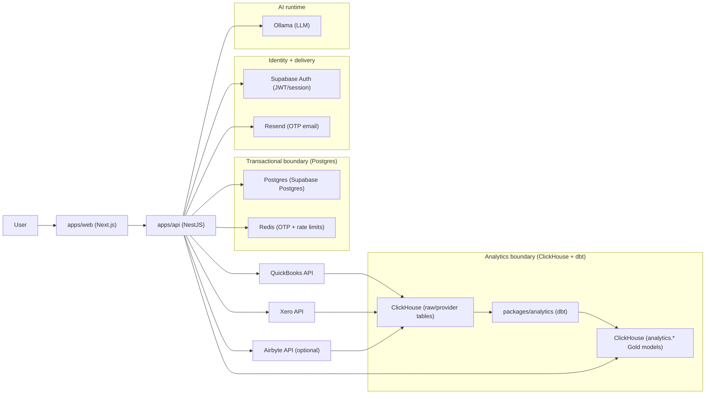
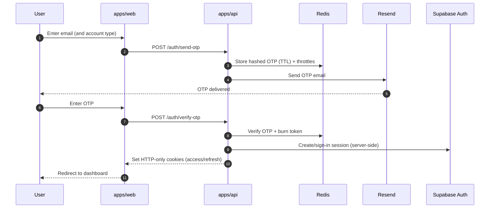
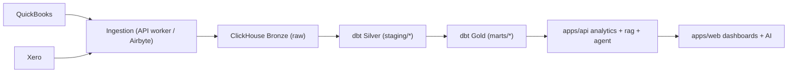
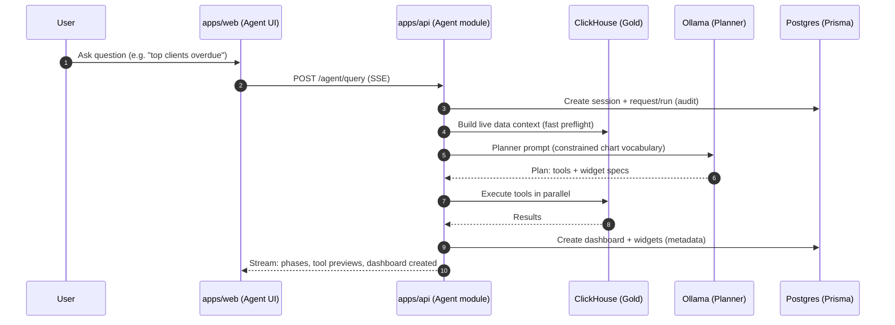

# Numeriqu Architecture (Diagrams + Flow)

This doc is the “flow chart” companion to `docs/architecture-log.md` and `docs/database-schema-numeriqu.md`.

## 1) System / Container view

What this enables:
- Postgres stays the source of truth for auth/org/messaging/dashboard metadata + audit trails.
- ClickHouse + dbt becomes the “facts engine” for dashboards + RAG/Agent reads (Gold models).
- Agent/RAG are tool-driven (query ClickHouse) and write only metadata back to Postgres.

## 2) Auth flow (Resend OTP → Supabase session)

Notes:
- Client never talks to Supabase directly; the API issues/refreshes sessions and sets HTTP-only cookies.
- `SUPABASE_INTERNAL_AUTH_SECRET` is security-critical (used to derive deterministic service passwords) — treat it like a production secret with rotation.

## 3) Data pipeline flow (providers → ClickHouse → dbt → Gold)

Operational “gotchas” to plan for:
- Freshness SLAs: define what “data is live” means (sync cadence + dbt run cadence + lag budgets).
- Backfills: re-running dbt models for historical fixes should be safe + auditable per connection.
- Multi-tenant isolation: ClickHouse queries should always filter by `connection_id` and/or `org_id` scope.

## 4) Agent dashboard generation flow (charts “generation”)

Why this is a “modern” pattern:
- The LLM is constrained (fixed widget vocabulary + allowed tools).
- Planning is separated from execution (tool calls are deterministic).
- Writes are auditable (request/run/event trail), and permissions can block dashboard creation.

## 5) Suggested improvements (roadmap)

If you want your architecture to match what top startups ship *in production*, these are the highest leverage next steps:

1. **Observability + incident readiness**
   - OpenTelemetry tracing (API → DB/ClickHouse/Redis/Resend/Ollama), dashboards + alerts, structured logs with `traceId`.
2. **Background jobs for ingestion and heavy work**
   - Queue + workers (BullMQ/Temporal/etc.) for provider sync, dbt runs, and “refresh dashboard” work (instead of request-thread execution).
3. **Data freshness contracts**
   - Per-connection last-sync + last-dbt-run timestamps, and UI messaging that reflects reality (avoid “live” when stale).
4. **Multi-org UX + strict context propagation**
   - First-class org switch in UI; always send `x-organization-id`; consider “active org” cookie and server validation.
5. **Hardening LLM ops**
   - Timeouts + retries + circuit breakers for Ollama, plus fallbacks that are user-visible (“degraded mode”).
6. **Test coverage where it matters**
   - E2E for auth + invite flows, and integration tests for org isolation in ClickHouse queries.
